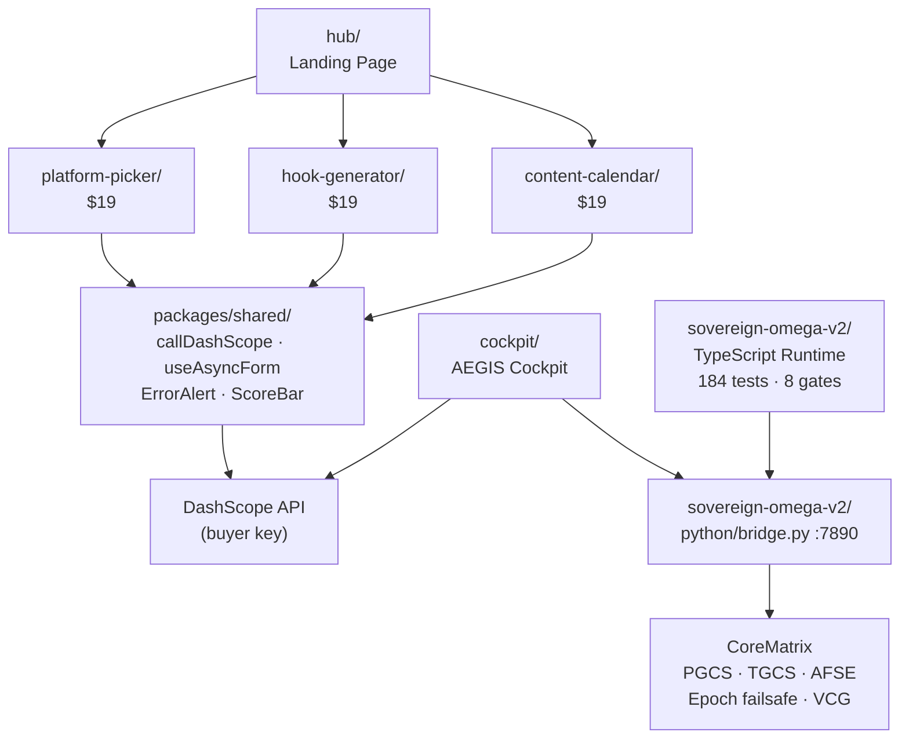

# AEGIS

**AI governance runtime + creator tools monorepo.**

[](#build--test)
[](#track-a--sovereign-omega-governance-runtime)
[](#)

Two independent tracks share this repo:

- **Track A — Sovereign Omega**: a deterministic, event-sourced governance runtime for AI decision workflows. TypeScript Layer A + Python Layer B. 184 tests, 8-gate build protocol.
- **Track B — Creator AI Toolkit**: three browser-based AI tools sold on Gumroad ($19 each). Zero backend — buyers supply their own DashScope API key.

---

## Monorepo Layout

| Directory | Track | Purpose |
|-----------|-------|---------|
| `sovereign-omega-v2/` | A | Governance runtime — TypeScript + Python |
| `cockpit/` | A | AEGIS Cockpit — AI chat UI with telemetry |
| `packages/shared/` | B | Shared DashScope wrapper, hooks, components |
| `platform-picker/` | B | Platform Picker — short-form video platform recommender |
| `hook-generator/` | B | Hook Generator — viral hook writer |
| `content-calendar/` | B | Content Calendar — 4-week content planner |
| `hub/` | B | Landing page connecting all three products |
| `docs/` | — | Architecture diagram, audit findings, corpus index |

---

## Track B — Creator AI Toolkit

Three tools that run entirely in the browser. Buyers enter their [DashScope](https://dashscope.aliyuncs.com) (Alibaba Cloud / Qwen) API key and get instant AI-powered output. No backend, no subscription.

| Product | What it does | Price |
|---------|-------------|-------|
| **Platform Picker** | Rank TikTok, YouTube Shorts, Instagram Reels, Snapchat Spotlight for your niche | $19 |
| **Hook Generator** | Generate 10 ranked viral hooks with type labels and copy buttons | $19 |
| **Content Calendar** | Full 4-week content plan with daily ideas, formats, and production notes | $19 |
| Bundle — any 2 | | $29 |
| Full Toolkit — all 3 | | $39 |

Each product deploys independently to Vercel (Root Directory set per product).

### Quick start — any product

```bash
cd platform-picker      # or hook-generator / content-calendar
cp .env.example .env    # add your VITE_DASHSCOPE_API_KEY
npm install
npm run dev             # http://localhost:5173
```

```bash
# Deploy
npm run build
vercel --prod
```

---

## Track A — Sovereign Omega Governance Runtime

`sovereign-omega-v2/` is a two-layer system:

```
TypeScript Runtime (src/)             Python Core Matrix (python/)
├── core/canonicalize.ts  Gate 1      ├── pgcs.py          swap I/O criterion
├── event/store.ts        Gate 2      ├── tgcs_afse.py     variance + R² tracking
├── event/immutable.ts    Gate 3      ├── core_matrix.py   M1/M2/M3 byte matrix
├── projection/reducer.ts Gate 4      ├── epoch_failsafe.py corruption guard
├── calibration/vcg.ts    Gate 5      ├── gradient_anchor.py drift calibration
├── gate/hoeffding.ts     Gate 6      └── bridge.py        HTTP bridge port 7890
├── pipeline/             Gate 7
└── runtime/              Gate 8
```

**Layer A** (TypeScript): append-only event substrate, Bernstein-gated decisions, VCG calibration, cryptographic hash-chaining, RFC 8785 canonical JSON.

**Layer B** (Python): hardware inference on AMD RX 570 / 8 GB RAM. Bit-shifted integer arithmetic throughout. PGCS swap-I/O criterion gates TGCS telemetry validity.

**Bridge**: `python/bridge.py` exposes a one-way HTTP API on port 7890. Cockpit polls `/telemetry` every 5 seconds.

### Build & Test

```bash
cd sovereign-omega-v2
npm install

# Eight-gate protocol — run in order, halt on any failure
npm run test -- test/unit/jcs.test.ts        # Gate 1 — RFC 8785 canonical JSON
npm run test -- test/unit/sequence.test.ts    # Gate 2 — atomic event sequences
npm run test -- test/unit/immutable.test.ts   # Gate 3 — deep-freeze immutability
npm run test -- test/unit/reducer.test.ts     # Gate 4 — pure state reducers
npm run test -- test/unit/vcg.test.ts         # Gate 5 — VCG calibration
npm run test -- test/unit/gate.test.ts        # Gate 6 — Bernstein confidence gate
npm run test -- test/integration/            # Gate 7 — replay + pipeline
npm run test && npm run typecheck && npm run build  # Gate 8 — deployment gate
```

```bash
# Python Layer B
pip install -r requirements.txt
python python/tests/stress_test.py --quick        # P1 smoke test (~60s)
python python/tests/stress_test.py --crash-loops  # P2 epoch failsafe (~10 min)
```

### Key Invariants

- No `Date.now()` outside `src/event/uuid.ts`
- No `Set`/`Map` in `ProjectionState` — arrays only (RFC 8785 requirement)
- No `JSON.stringify` for integrity — use `canonicalizeJCS`
- Bernstein anytime-valid bounds, not Hoeffding
- `deepFreeze` every state object after construction
- Version mismatch = hard abort, no fallback

---

## Architecture



---

## Docs

| File | Contents |
|------|----------|
| [`docs/architecture.md`](docs/architecture.md) | Mermaid architecture diagram, module map |
| [`docs/AUDIT_FINDINGS.md`](docs/AUDIT_FINDINGS.md) | Holonic audit findings, all tiers |
| [`docs/HOLONIC_AUDIT.md`](docs/HOLONIC_AUDIT.md) | Full system holonic analysis |
| [`docs/CORPUS_MINDMAP.md`](docs/CORPUS_MINDMAP.md) | Drive corpus semantic lattice (222+ documents) |
| [`sovereign-omega-v2/CLAUDE.md`](sovereign-omega-v2/CLAUDE.md) | Operator memory — architecture constraints |
| [`sovereign-omega-v2/AGENTS.md`](sovereign-omega-v2/AGENTS.md) | Agent execution protocol |

---

## Environment Variables

```bash
# All three commercial products
VITE_DASHSCOPE_API_KEY=sk-...        # required — buyer supplies
VITE_DASHSCOPE_MODEL=qwen-plus       # optional — default: qwen-plus

# Cockpit only
VITE_OLLAMA_BASE_URL=http://HOST:11434/v1
VITE_BRIDGE_URL=http://localhost:7890  # sovereign-omega bridge
```

Each product has a `.env.example`. Copy to `.env` and fill in your key. `.env` files are gitignored.

---

## Tech Stack

| Layer | Stack |
|-------|-------|
| Commercial products | Vite + React 18 + TypeScript + Tailwind CSS + DashScope |
| Governance runtime | TypeScript 5 + Vite + Vitest + RFC 8785 JCS |
| Python layer | Python 3.11 + NumPy + psutil + threading |
| Deploy | Vercel (one project per product) |
| Sell | Gumroad |
