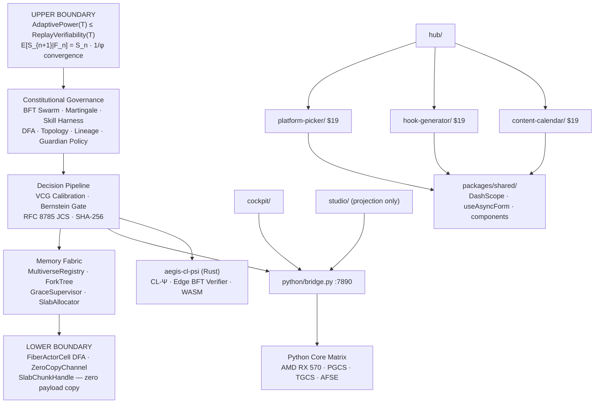

# AEGIS

**Dual Infinite Boundary Framework — AI governance runtime + creator tools.**

[](#build--test)
[](#track-a--sovereign-omega-governance-runtime)
[](#)

---

## The Dual Infinite Boundary

AEGIS is structured around two infinite boundaries that operate in complementary directions across every holonic scale.

```
╔═══════════════════════════════════════════════════════════════════╗
║  UPPER BOUNDARY — Constitutional Sovereignty                      ║
║  AdaptivePower(T) ≤ ReplayVerifiability(T)                        ║
║  No adaptive action can exceed what is replay-certifiable.        ║
║  E[S_{n+1}|F_n] = S_n — system cannot evolve faster than it can  ║
║  certify. Convergence governed by 1/φ ≈ 0.6180 at three scales.  ║
╠═══════════════════════════════════════════════════════════════════╣
║                                                                   ║
║   FIELD      → Claude · ChatGPT · Qwen · operators · corpus       ║
║   ORGANISM   → Sovereign-Omega V2 runtime (2648 tests)            ║
║   CELLULAR   → BFT Swarm · Martingale · Skill Harness             ║
║   MOLECULAR  → Constitutional reduction · VCG · DFA               ║
║   ATOMIC     → Events · Sequences · Canonicalization              ║
║   SUBATOMIC  → RFC 8785 bytes · SHA-256 · Bernstein bounds        ║
║                                                                   ║
╠═══════════════════════════════════════════════════════════════════╣
║  LOWER BOUNDARY — Execution Isolation                             ║
║  Zero-copy fiber isolation: only SlabChunkHandle crosses          ║
║  fiber boundaries. Payload bytes never leave their slab.          ║
║  Grace Loop seals crashed fibers without corruption.              ║
╚═══════════════════════════════════════════════════════════════════╝
```

**Upper boundary** — governance layer — bounds what the system can *become*: every adaptive action is recorded, hash-chained, and certifiable. The martingale ensures the system evolves no faster than it can prove. The 1/φ golden ratio unifies the quorum threshold, mutation rate limit, and martingale suspension boundary across statistical, constitutional, and consensus scales.

**Lower boundary** — memory fabric — bounds what the system can *access*: zero-copy inter-fiber communication via `SlabChunkHandle` (slab_id + chunk_index + SHA-256), epoch-based slab allocation with 64-bit bitmap management, and `FiberActorCell` DFA isolation (ACTIVE → TERMINATED). The Grace Loop ensures that when a fiber crashes, its inbox is atomically cleared and its execution seal is irreversible.

These two boundaries are self-similar across all six holonic scales. A violation at SUBATOMIC propagates upward and invalidates every scale above it.

---

## Monorepo Layout

| Directory | Track | Purpose |
|-----------|-------|---------|
| `sovereign-omega-v2/` | A | Governance runtime — TypeScript + Python (2648 tests) |
| `aegis-cl-psi/` | A | CL-Ψ cognitive fabric — 6-phase Rust inference crate for AMD RX 570 |
| `cockpit/` | A | AEGIS Cockpit — AI chat UI with sovereignty telemetry |
| `studio/` | A | AEGIS Studio — constitutional observability (projection only) |
| `packages/shared/` | B | Shared DashScope wrapper, hooks, components |
| `platform-picker/` | B | Platform Picker — short-form video platform recommender ($19) |
| `hook-generator/` | B | Hook Generator — viral hook writer ($19) |
| `content-calendar/` | B | Content Calendar — 4-week content planner ($19) |
| `hub/` | B | Landing page connecting all three products |
| `docs/` | — | Architecture, audit findings, corpus index |

---

## Track A — Sovereign Omega Governance Runtime

`sovereign-omega-v2/` implements the full dual boundary stack in two layers.

**Layer A — TypeScript Governance Runtime (198 gates)**

```
Constitutional Upper Boundary
  ┌──────────────────────────────────────────────────────────┐
  │ BFT Synthesis Swarm · Skill Harness · RALPH Executor     │
  │ Martingale Certifier · Swarm Convergence (1/φ)           │
  │ Guardian Policy · Constitutional Reduction               │
  │ Epoch Chain · DFA · Topology · Lineage · Divergence      │
  │ VCG Calibration · Bernstein Gate · RFC 8785 JCS          │
  └──────────────────────────────────────────────────────────┘
Execution Lower Boundary
  ┌──────────────────────────────────────────────────────────┐
  │ FiberActorCell (ACTIVE→TERMINATED DFA)                   │
  │ ZeroCopyChannel (SlabChunkHandle inbox)                  │
  │ SlabAllocator (64-bit bitmap, 4 tiers, epoch epochs)     │
  │ GraceSupervisor (fault isolation, state reversion)       │
  │ ForkTree (universe genealogy DAG)                        │
  │ MultiverseRegistry (8 parallel AdaptiveLineage branches) │
  └──────────────────────────────────────────────────────────┘
```

**Layer B — Python Core Matrix**

Hardware inference on AMD RX 570 / 8 GB RAM. Bit-shifted integer arithmetic throughout. PGCS swap-I/O criterion gates TGCS telemetry validity. `python/bridge.py` exposes a one-way HTTP API on port 7890.

**CL-Ψ Cognitive Fabric (Rust)**

`aegis-cl-psi/` — 6-phase Rust inference crate: SGM-Ψ sparse gating, LUT-KAN routing, RWKV-7 state cache, DEVS-Ψ scheduler, SAHOO-Ψ hallucination monitoring, CCIL-Ψ constitutional lattice. Stateless Edge BFT Verifier (WASM-compatible). EU AI Act Article 12 compliant.

### Build & Test

```bash
cd sovereign-omega-v2
npm install

# Eight-gate protocol — halt on any failure
npm run test -- test/unit/jcs.test.ts        # Gate 1 — RFC 8785 canonical JSON
npm run test -- test/unit/sequence.test.ts    # Gate 2 — atomic event sequences
npm run test -- test/unit/immutable.test.ts   # Gate 3 — deep-freeze immutability
npm run test -- test/unit/reducer.test.ts     # Gate 4 — pure state reducers
npm run test -- test/unit/vcg.test.ts         # Gate 5 — VCG calibration
npm run test -- test/unit/gate.test.ts        # Gate 6 — Bernstein confidence gate
npm run test -- test/integration/            # Gate 7 — replay + pipeline
npm run test && npm run typecheck && npm run build  # Gate 8 — deployment gate
```

```bash
# Python Layer B
pip install -r requirements.txt
python python/tests/stress_test.py --quick        # P1 smoke (~60s)
python python/tests/stress_test.py --crash-loops  # P2 epoch failsafe (~10 min)
```

### Core Invariants

```
AdaptivePower(T) ≤ ReplayVerifiability(T)         — upper boundary
Zero-copy: only SlabChunkHandle crosses fiber      — lower boundary
E[S_{n+1}|F_n] = S_n                              — martingale law
MUTATION_RATE_LIMIT = 1/φ = (√5−1)/2 ≈ 0.6180    — holonic constant
Law of Silence: agents communicate via EventEnvelope only
```

- No `Date.now()` outside `src/event/uuid.ts`
- No `Set`/`Map` in `ProjectionState` — arrays only (RFC 8785)
- No `JSON.stringify` for integrity — use `canonicalizeJCS`
- `deepFreeze` every state object after construction
- Version mismatch = hard abort

---

## Track B — Creator AI Toolkit

Three tools that run entirely in the browser. Buyers enter their DashScope (Alibaba Cloud / Qwen) API key — no backend, no subscription.

| Product | What it does | Price |
|---------|-------------|-------|
| **Platform Picker** | Rank TikTok, YouTube Shorts, Instagram Reels, Snapchat Spotlight for your niche | $19 |
| **Hook Generator** | Generate 10 ranked viral hooks with type labels and copy buttons | $19 |
| **Content Calendar** | Full 4-week content plan with daily ideas, formats, and production notes | $19 |
| Bundle — any 2 | | $29 |
| Full Toolkit — all 3 | | $39 |

```bash
cd platform-picker      # or hook-generator / content-calendar
cp .env.example .env    # add VITE_DASHSCOPE_API_KEY
npm install && npm run dev
```

---

## Architecture



---

## Environment Variables

```bash
# Commercial products
VITE_DASHSCOPE_API_KEY=sk-...        # required — buyer supplies
VITE_DASHSCOPE_MODEL=qwen-plus       # optional

# Cockpit
VITE_OLLAMA_BASE_URL=http://HOST:11434/v1
VITE_BRIDGE_URL=http://localhost:7890
```

---

## Tech Stack

| Layer | Stack |
|-------|-------|
| Governance runtime | TypeScript 5 · Vite · Vitest · RFC 8785 JCS · SHA-256 |
| Memory fabric | TypeScript · BigInt bitmaps · 64-bit slab allocation |
| Rust inference | Rust · ed25519-dalek · serde_json · WASM target |
| Commercial products | Vite · React 18 · TypeScript · Tailwind · DashScope |
| Python layer | Python 3.11 · NumPy · psutil |
| Deploy | Vercel (one project per product) |

---

## Docs

| File | Contents |
|------|----------|
| [`sovereign-omega-v2/docs/TRACEABILITY.md`](sovereign-omega-v2/docs/TRACEABILITY.md) | Full gate map — all 198 layers |
| [`sovereign-omega-v2/docs/SOVEREIGN_RUNTIME_HANDOFF_v1.0.md`](sovereign-omega-v2/docs/SOVEREIGN_RUNTIME_HANDOFF_v1.0.md) | Constitutional law — 19 sections |
| [`sovereign-omega-v2/docs/SKILL_HARNESS_SPECIFICATION.md`](sovereign-omega-v2/docs/SKILL_HARNESS_SPECIFICATION.md) | Skill Harness spec — 30 sections |
| [`sovereign-omega-v2/docs/CONSTITUTIONAL_DECLARATION.md`](sovereign-omega-v2/docs/CONSTITUTIONAL_DECLARATION.md) | Constitutional declaration |
| [`docs/architecture.md`](docs/architecture.md) | Architecture diagram, module map |
| [`CLAUDE.md`](CLAUDE.md) | Operator memory — coordination document |
